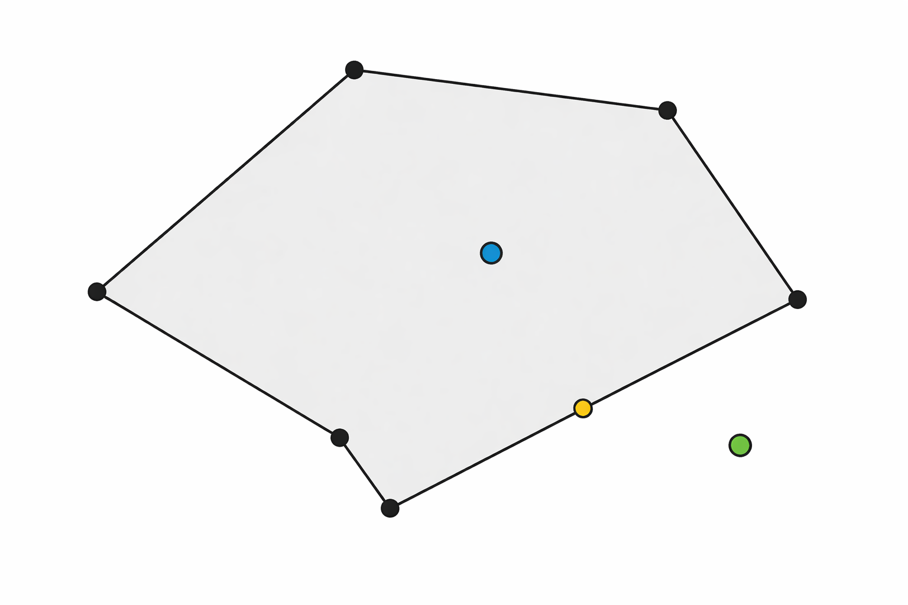
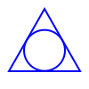

# Polygon Geometry Project

## 1. Introduction
This project implements a computational geometry module in C++ consisting of:

- A **Point** class representing 2D points.
- A **Polygon** class storing a dynamic list of points and providing geometric operations such as perimeter and convexity testing.
- A **test harness** that reads polygon data from a file (`polygons.txt`), verifies their correctness, and prints test results.
- A **Makefile** that automates building the project.

This project is designed both for geometry computation and for learning memory management, dynamic arrays, and testing.

---

## 2. The Math Behind Determining Convexity

A polygon is **convex** if all interior angles are ≤ 180°. Geometrically, this means every turn made while walking around the polygon is either always left-turning or always right-turning.

### 2.1 Using the Cross Product

Given three points:

```
A → B → C
```

Compute the 2D cross product:

```math
\begin{matrix}
\vec{AB} = B - A \\
\vec{BC} = C - B \\
\text{cross}(A,B,C) = AB_x \cdot BC_y - AB_y \cdot BC_x
\end{matrix}
```

The sign of the result determines the turn direction:

- **Positive** → Left turn (counterclockwise)
- **Negative** → Right turn (clockwise)
- **Zero** → Collinear

### 2.2 Convexity Condition

A polygon is convex if **all cross products have the same sign** (ignoring zeros).  
If both positive and negative signs appear → the polygon is concave.

---

## 3. Implementation Overview

### 3.1 The `Point` Class

Stores a coordinate pair `(x, y)` and provides:

- Getters and setters
- Distance computation
- String output
- Equality check

**Important:**  
There is **no default constructor**, so you must always specify `(x, y)` when creating a `Point`.  
This avoids undefined coordinate states.

---

### 3.2 The `Point**` Structure in `Polygon`

The `Polygon` class stores:

```cpp
Point** _points;
int _numPoints;
int _capacity;
```

This means:

- `_points` is a **dynamic array of pointers** to `Point` objects.
- Each `Point` is individually allocated with `new`.
- The destructor frees all allocated memory.
- The copy constructor and assignment operator implement a **deep copy**.

Why use `Point**`?

- Because `Point` has *no default constructor*, you cannot create `Point[]` without initializing each element.
- Using pointers teaches explicit heap management.
- It allows representing "empty" slots by storing `nullptr`.

This is excellent for educational purposes, even though in modern C++ you might prefer `std::vector<Point>` or smart pointers.

### `Point**` in Action


The animation above shows how the constructor of class `Polygon` is called and it creates an array to `Point*`. After this, it shows what happens when four points are added using the `AddPoint(const Point&)` method.

---

## 4. Building With `make`

Your Makefile supports:

### Build main program

```bash
make
```

### Build test program

```bash
make test
```

### Clean all build artifacts

```bash
make clean
```

The Makefile compiles the program using:

```
-std=c++20 -Wall -Wextra -Wpedantic -g
```

and places object files in the `build/` directory and executables in `exe/`.

---

## 5. Diagrams

Below are visual aids that help understand the geometry and structure used in this project.

### 5.1 Convex vs Concave Polygons


### 5.2 Cross Product and Turn Direction
This diagram illustrates three points A, B, and C and the vectors AB and BC,
showing how a positive cross product corresponds to a left (counterclockwise) turn.


### 5.3 Flowchart of the Convexity Algorithm
This flowchart shows the logical steps used to determine whether a polygon is convex
by examining the sign of cross products around the polygon.


## 6. File Structure

```
.
├── point.h
├── point.cpp
├── polygon.h
├── polygon.cpp
├── test.cpp
├── file_tests.cpp
├── main.cpp
├── polygons.txt
├── makefile
└── README.md
```

---

## 7. Summary

This project demonstrates:

- Geometric computation (distance, perimeter, convexity)
- Manual memory management in C++
- The cross‑product convexity test
- Automated building via `make`
- File‑driven testing and validation

It is a well‑structured foundation for teaching geometry, C++ objects, and algorithmic thinking.

---

## Our task

This repository is part of an activity to refresh previous courses concepts and to setup the development environment for the Data Structures and Algorithms class.

The activity's tasks are:
1. Install the necessary software: GitHub desktop, Visual Studio Code, Docker for Mac users, and WSL2 for Windows users.
2. Practice using the command line. (cd, mkdir, rm, ls, cat, pwd)
3. Setup command line tools: gh
4. Setup IDE: Visual Studio Code with Ubuntu
5. Work on the Polygon project to test the Development Environment
6. Modify the Polygon project

## Polygon Modification

You will implement a new method for the class `Polygon`. This method will receive a `Point` as parameter and will determine if the point is in, on, or outside the Polygon.



The image above shows a seven point polygon. The blue dot is a point inside the polygon, the yellow dot is a point on (an edge) the polygon, and the green dot is outside the polygon. 

The method declaration is:
```c++
PointLocation LocatePoint(const Point& point) const;
```

The method will return:
* `PointLocation::Outside` if `point` is located outside of `this`
* `PointLocation::OnEdge` if `point` is located on any of the edges of `this`, in other words if it's on any of the lines that make up the polygon.
* `PointLocation::Inside` if the `point` is located inside `this`

You may assume that this method is only going to be called when the polygon is convex, but you are wellcome to code a more generalized algorithm.

## Polygon Modification (Extra Credit)

Implement an additional method to export the polygon to an SVG file. SVG is an image file format that does not require you to use any additional libraries. It is basically a text file that describes the image that it contains. SVG stands for Scalable Vector Graphics.

Below you can see an SVG file that represents

```xml
<?xml version="1.0" encoding="UTF-8"?>
<svg
    xmlns="http://www.w3.org/2000/svg"
    width="100"
    height="100"
    viewBox="0 0 100 100">

    <!-- Background -->
    <rect x="0" y="0" width="100" height="100" fill="white"/>

    <!-- Equilateral triangle -->
    <!-- Vertices: (50,10), (10,80), (90,80) -->
    <polygon
        points="50,10 10,80 90,80"
        fill="none"
        stroke="blue"
        stroke-width="2"/>

    <!-- Inscribed circle -->
    <!-- Center at centroid (50,56.67), radius ≈ 23 -->
    <circle
        cx="50"
        cy="56.67"
        r="23"
        fill="none"
        stroke="blue"
        stroke-width="2"/>

</svg>
```

The text above represents the following image:



Your mission is to research a little bit more about how to "draw" the polygon into an SVG file. Use AI **only** to understand how SVG works, **not** to get the code!
