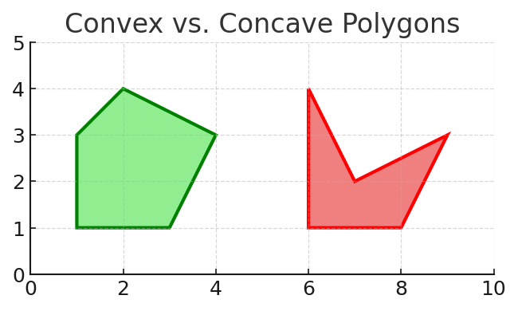
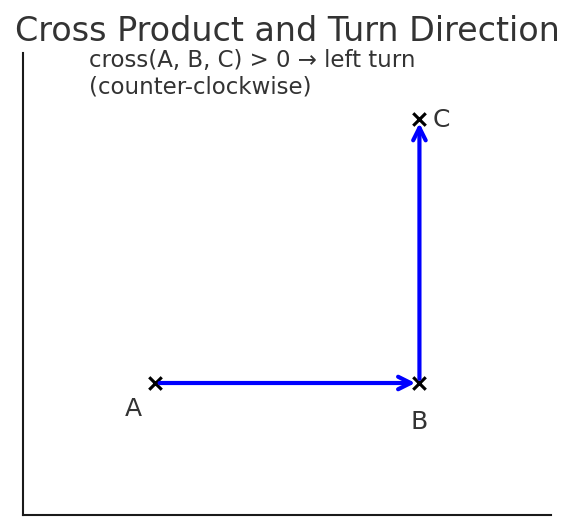
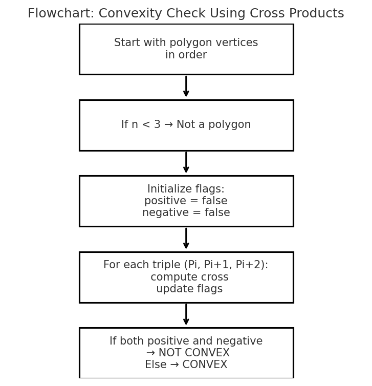

# Polygon Geometry Project

## 1. Introduction
This project implements a computational geometry module in C++ consisting of:

- A **Point** class representing 2D points.
- A **Polygon** class storing a dynamic list of points and providing geometric operations such as perimeter and convexity testing.
- A **test harness** that reads polygon data from a file (`polygons.txt`), verifies their correctness, and prints test results.
- A **Makefile** that automates building the project.

This project is designed both for geometry computation and for learning memory management, dynamic arrays, and testing.

---

## 2. The Math Behind Determining Convexity

A polygon is **convex** if all interior angles are ≤ 180°. Geometrically, this means every turn made while walking around the polygon is either always left-turning or always right-turning.

### 2.1 Using the Cross Product

Given three points:

```
A → B → C
```

Compute the 2D cross product:

$$
\vec{AB} = B - A \\

\vec{BC} = C - B \\

\text{cross}(A,B,C) = AB_x \cdot BC_y - AB_y \cdot BC_x

$$

The sign of the result determines the turn direction:

- **Positive** → Left turn (counterclockwise)
- **Negative** → Right turn (clockwise)
- **Zero** → Collinear

### 2.2 Convexity Condition

A polygon is convex if **all cross products have the same sign** (ignoring zeros).  
If both positive and negative signs appear → the polygon is concave.

---

## 3. Implementation Overview

### 3.1 The `Point` Class

Stores a coordinate pair `(x, y)` and provides:

- Getters and setters
- Distance computation
- String output
- Equality check

**Important:**  
There is **no default constructor**, so you must always specify `(x, y)` when creating a `Point`.  
This avoids undefined coordinate states.

---

### 3.2 The `Point**` Structure in `Polygon`

The `Polygon` class stores:

```cpp
Point** _points;
int _numPoints;
int _capacity;
```

This means:

- `_points` is a **dynamic array of pointers** to `Point` objects.
- Each `Point` is individually allocated with `new`.
- The destructor frees all allocated memory.
- The copy constructor and assignment operator implement a **deep copy**.

Why use `Point**`?

- Because `Point` has *no default constructor*, you cannot create `Point[]` without initializing each element.
- Using pointers teaches explicit heap management.
- It allows representing "empty" slots by storing `nullptr`.

This is excellent for educational purposes, even though in modern C++ you might prefer `std::vector<Point>` or smart pointers.

### `Point**` in Action


The animation above shows how the constructor of class `Polygon` is called and it creates an array to `Point*`. After this, it shows what happens when four points are added using the `AddPoint(const Point&)` method.

---

## 4. Building With `make`

Your Makefile supports:

### Build main program

```bash
make
```

### Build test program

```bash
make test
```

### Clean all build artifacts

```bash
make clean
```

The Makefile compiles the program using:

```
-std=c++20 -Wall -Wextra -Wpedantic -g
```

and places object files in the `build/` directory and executables in `exe/`.

---

## 5. Diagrams

Below are visual aids that help understand the geometry and structure used in this project.

### 5.1 Convex vs Concave Polygons


### 5.2 Cross Product and Turn Direction
This diagram illustrates three points A, B, and C and the vectors AB and BC,
showing how a positive cross product corresponds to a left (counterclockwise) turn.


### 5.3 Flowchart of the Convexity Algorithm
This flowchart shows the logical steps used to determine whether a polygon is convex
by examining the sign of cross products around the polygon.



## 6. File Structure

```
.
├── point.h
├── point.cpp
├── polygon.h
├── polygon.cpp
├── test.cpp
├── main_file_tests.cpp
├── polygons.txt
├── Makefile
└── README.md
```

---

## 7. Summary

This project demonstrates:

- Geometric computation (distance, perimeter, convexity)
- Manual memory management in C++
- The cross‑product convexity test
- Automated building via `make`
- File‑driven testing and validation

It is a well‑structured foundation for teaching geometry, C++ objects, and algorithmic thinking.

---

